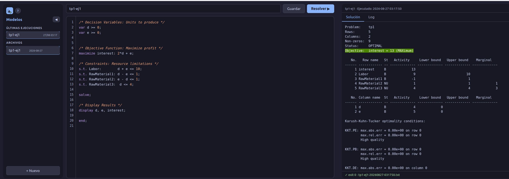

# Como correr el proyecto

## *Este proyecto corre sobre docker pero se puede instalar los req localmente si se quiere y usar el src

## Arrancar (o reconstruir tras cambiar código)
docker compose up -d --build

## abrir la app
## http://localhost:8000

## frenar
docker compose down

Si el puerto 8000 está ocupado en tu máquina, cambiá el mapeo en compose.yaml por otro (por ejemplo "8010:8000").

